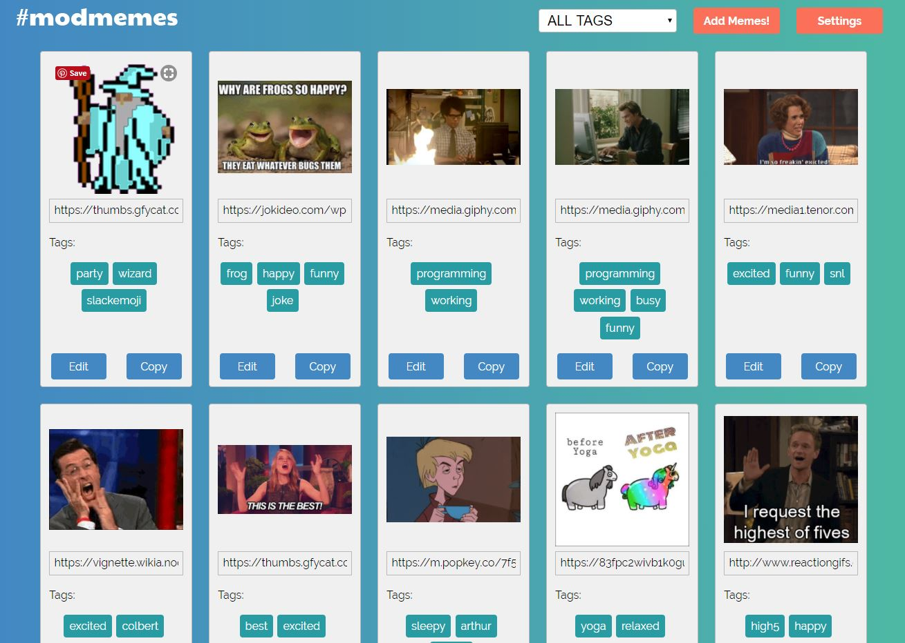

# modmemes

### Built using React, Redux, Express, Node and MongoDB

Don't let your memes be dreams! Have your favorite memes on hand for sharing in Slack or anywhere else on the web.  
This app stores the links to your favorite memes, uses tags for easy sorting and copies the link with a push of a button.  
Simple interface, clean design and preset color themes to choose from (list is growing).    

# [Live Demo](https://match-three-component.herokuapp.com/)  

Head over to Heroku for a [live demo](https://match-three-component.herokuapp.com/).  

